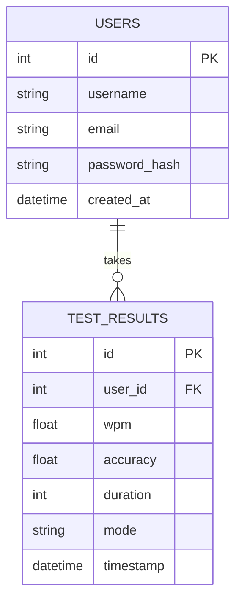

# ⌨️ TypoPulse — Premium Typing Speed Test

TypoPulse is a high-fidelity, responsive typing speed test application inspired by Monkeytype. Built as a portfolio project, it demonstrates a complete full-stack workflow combining a Python **Flask** backend (utilizing the **Application Factory** and **Blueprint** patterns), **SQLite** database records, **Tailwind CSS v3** modern interface design, and **Chart.js** data visualizations.

---

## 🚀 Key Features

*   **Zero-Input Latency Typing Engine:** Custom client-side JavaScript captures input events directly to support fast and responsive typing feedback.
*   **Smooth Gliding Caret:** An absolute-positioned custom cursor that glides smoothly from character to character using element coordinates.
*   **Active Visual Feedback:** Standard letter highlighting (green for correct, red for incorrect, and support for typing extra letters).
*   **Dynamic Viewport Line-Scrolling:** Automatically calculates line breaks and scrolls the word list upward once you type past the second line.
*   **Real-time & Final Performance Charts:** Utilizes Chart.js to capture and plot second-by-second WPM performance at the end of the test.
*   **Secure Authentication System:** Traditional Register/Login flow utilizing session management and password hashing via `werkzeug.security`.
*   **Developer Dashboard:** Track metrics over time, including Total Tests taken, Average Speed (WPM), Average Accuracy (%), and Personal Best records.

---

## 🛠️ Technology Stack

*   **Backend:** Python 3.10+, Flask (Application Factory & Blueprints), Flask-SQLAlchemy, Flask-Login
*   **Frontend:** HTML5, Tailwind CSS v3 (Play CDN), FontAwesome Icons
*   **Database:** SQLite (file-based database)
*   **Charts:** Chart.js v4+

---

## 📁 Project Structure

```text
Typing SpeedTest/
│
├── run.py                 # Application entrypoint (calls create_app())
├── requirements.txt      # Python dependencies
├── .env                  # Environment configurations
├── .gitignore            # Git exclusion rules
│
└── app/                  # Core application package
    ├── __init__.py        # Application Factory (creates app, binds extensions & blueprints)
    ├── extensions.py      # Shared Flask extensions (prevents circular imports)
    ├── models.py          # SQLAlchemy models (User & TestResult schemas)
    │
    ├── auth/              # Authentication Blueprint
    │   ├── __init__.py    # Blueprint definition
    │   └── routes.py      # Login, Register, Logout routes
    │
    ├── main/              # Main App Blueprint
    │   ├── __init__.py    # Blueprint definition
    │   └── routes.py      # Core typing logic rendering, dashboard and API endpoints
    │
    ├── static/            # Static assets
    │   ├── data/
    │   │   └── words.json # JSON dictionary containing standard test words
    │   └── js/
    │       └── app.js     # Core typing test client-side engine
    │
    └── templates/         # HTML Jinja2 Templates
        ├── base.html      # Master template layout (glowing dark theme & navbar)
        ├── index.html     # Main typing speed test interface
        ├── dashboard.html # Statistics logging & performance history graphs
        ├── login.html     # Authentication forms
        └── register.html  # User registration forms
```

---

## ⚙️ Installation & Local Setup

Follow these steps to run the application locally on your computer:

### 1. Clone the repository
```bash
git clone https://github.com/<YOUR_USERNAME>/<YOUR_REPO_NAME>.git
cd typing-speed-test
```

### 2. Initialize Virtual Environment
```bash
# Create the environment
python -m venv .venv

# Activate it (Windows PowerShell)
.\.venv\Scripts\Activate.ps1

# Activate it (Mac/Linux/Git Bash)
source .venv/bin/activate
```

### 3. Install Dependencies
```bash
pip install -r requirements.txt
```

### 4. Run the Application
```bash
python run.py
```

The server will initialize the local database file `instance/typing_test.db` and start running. Open your browser and navigate to:
👉 **`http://127.0.0.1:5000`**

---

## 📊 Database Schema


